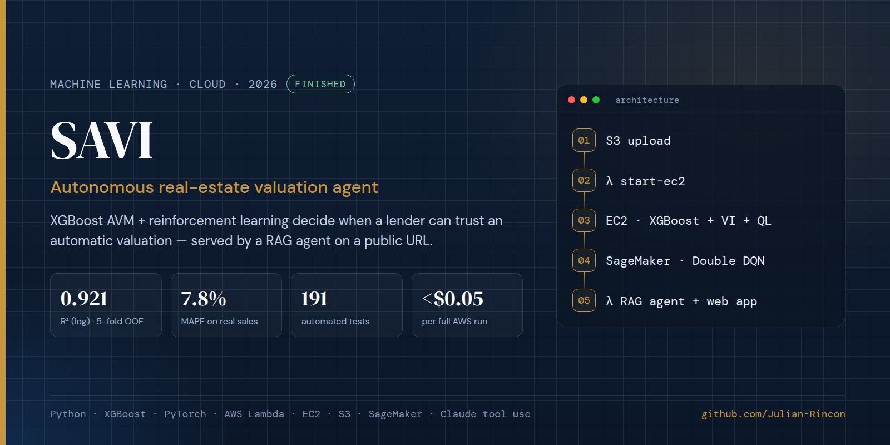
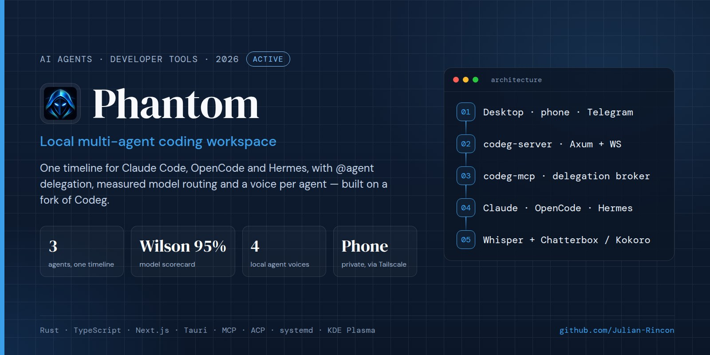
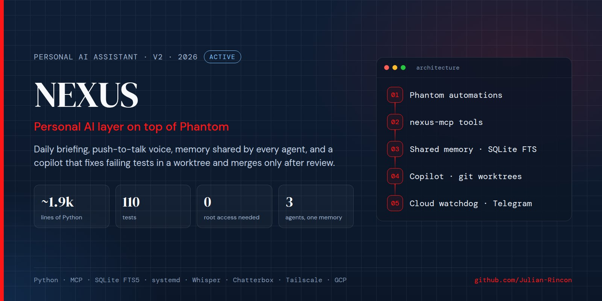
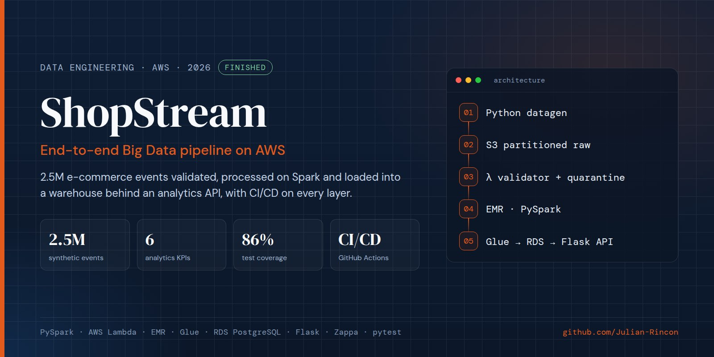
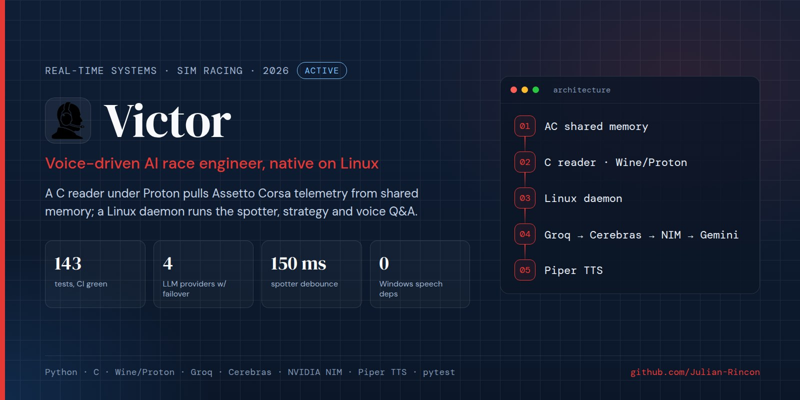
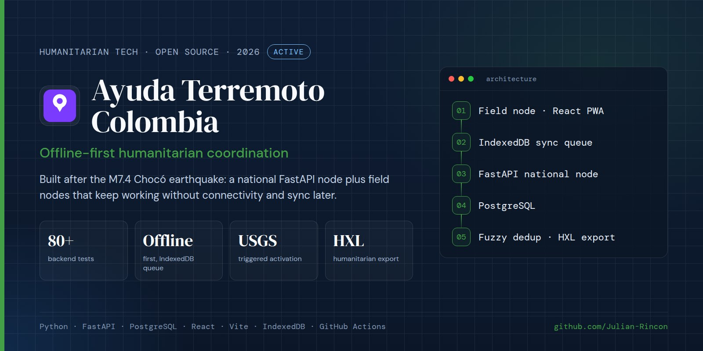
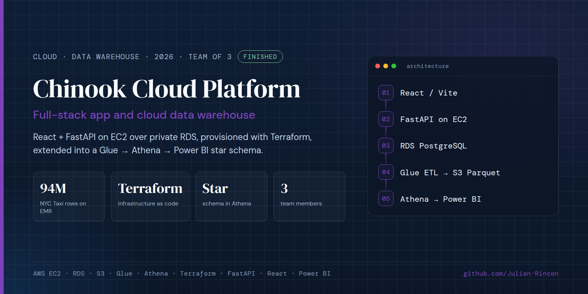
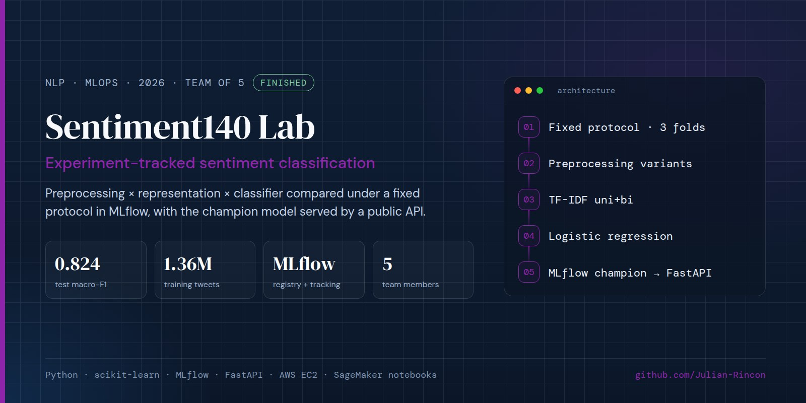
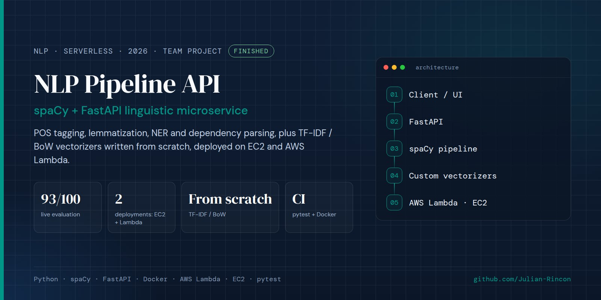
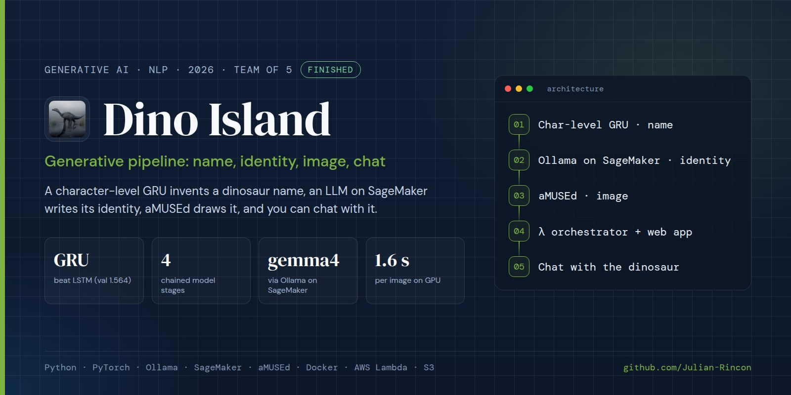

<div align="center">

<h1>Julian Rincón</h1>
<h3>ML Engineering · Data Engineering · AI Agents · Cloud Systems</h3>

<br/>

[](https://www.linkedin.com/in/julian-esteban-rinc%C3%B3n-rodriguez-1a05501b7/)
[](https://julian-rincon.github.io)
[](mailto:julianer2002@gmail.com)
[](https://www.credly.com/go/UGp1CUEB)


</div>

---

## About

I don't build demos. I build systems that run.

Final-semester (9th of 9) Computer Science & Artificial Intelligence student at Universidad Sergio Arboleda, Bogotá. I work where machine learning, data infrastructure and AI agents meet: event-driven pipelines on AWS, models evaluated honestly on held-out data, and agent tooling that I use every day on my own Linux workstation.

Looking for a six-month **ML / Data Engineering internship (January – June 2027)**, and after graduating, an MSc in Germany.

```python
julian = {
    "degree":   "B.Sc. CS & AI, final semester (9/9), GPA 4.04/5.0",
    "focus":    ["ML Engineering", "Data Engineering", "AI Agents", "Cloud Systems"],
    "shipped":  [
        "SAVI v3  - RL + RAG valuation agent on an event-driven AWS pipeline (live demo)",
        "Phantom  - local multi-agent workspace for Claude Code, OpenCode and Hermes",
        "NEXUS v2 - personal AI assistant on Phantom: briefing, voice, shared memory, copilot",
        "ShopStream - 2.5M-event Big Data pipeline on AWS (Lambda, EMR, Glue, RDS)",
    ],
    "stack":    ["Python", "PyTorch", "XGBoost", "PySpark", "AWS", "FastAPI", "Rust", "TypeScript"],
    "won":      ["USABOT Robotics Challenge - 1st place overall (Nov 2025)",
                 "Wisibilízalas, Univ. Pompeu Fabra - 1st place, international (2019)"],
    "open_to":  ["internships", "research collaborations", "freelance"],
}
```

---

## Featured Projects

### [SAVI — Autonomous Real-Estate Valuation Agent](https://github.com/Julian-Rincon/ames-housing-ml) · `Finished`

[](https://github.com/Julian-Rincon/ames-housing-ml)

An Automated Valuation Model predicts a house price; SAVI decides **when a lender should trust it**. Reinforcement learning chooses whether to APPROVE the automatic valuation, send it to human REVIEW, or REJECT it, based on the economic cost of being wrong.

- **v1–v2 (team, Machine Learning course):** with Valeria Larea, Nicolás Garzón and Juan Niño — MDP + Value Iteration, Q-Learning, DQN and a consensus policy, IEEE-style paper.
- **v3 (individual):** I audited v2, found that most of its dataset was padded assessor records (its R² = 0.96 was an artifact), rebuilt the data from real public sources (2,930 sales joined to 18,078 parcels, FHFA and Zillow indices), and re-engineered the project as an **event-driven AWS pipeline** (S3 → Lambda → EC2 → Lambda → SageMaker) with a **RAG agent** (8 tools, Claude tool use, deterministic fallback) served from a public Lambda URL.
- **Results, measured honestly:** XGBoost AVM with 5-fold out-of-fold **R²(log) = 0.921, MAPE 7.8 %**; test results reported once with bootstrap 95 % CIs — the Double DQN overfits and no rule beats Value Iteration significantly, and the README says so.
- **Engineering:** 191 tests, GitHub Actions CI, boto3 infrastructure as code, self-terminating EC2 and SageMaker Spot — a full run costs **under US$0.05**.

[Live demo](https://5w442qdw5roag3chtm6esbohfu0mwaap.lambda-url.us-east-1.on.aws/) · [Repository](https://github.com/Julian-Rincon/ames-housing-ml)

`Python` `XGBoost` `PyTorch` `Double DQN` `AWS Lambda` `EC2` `SageMaker` `S3` `RAG` `Claude API`

---

### [Phantom — Local Multi-Agent Coding Workspace](https://github.com/Julian-Rincon/phantom) · `Active`

[](https://github.com/Julian-Rincon/phantom)

One local interface for **Claude Code, OpenCode and Hermes Agent**: a single timeline, one agent/model selector and delegation between agents through `@Agent` mentions. Built on [my fork](https://github.com/Julian-Rincon/codeg) of the open-source Codeg workspace (Apache-2.0) instead of rewriting its ACP client, streaming and permissions layer.

- **What I added:** OpenCode 2.x history import, a model scorecard that ranks models from measured session history (Wilson 95 % interval) and drives model-aware delegation and quota failover, a fully local voice layer (Whisper large-v3-turbo on CUDA for speech-to-text, a distinct voice per agent with Chatterbox and Kokoro, and a "listen" button on every answer), a compact Telegram bridge with conversation menus, and **Phantom Island**, a Tauri overlay rendered as a native Wayland layer-shell surface.
- **Operations:** runs as hardened systemd user services bound to loopback with token auth and resource limits, integrated with KDE Plasma, and reachable from my phone (chat and voice) only through a private Tailscale network over HTTPS. A deploy script verifies 12 checks after every install, and the fork is kept merged with upstream releases (v0.32.4, v0.33.0).

`Rust` `TypeScript` `Next.js` `Tauri` `MCP` `ACP` `Whisper` `systemd` `KDE Plasma`

---

### [NEXUS v2 — Personal AI Assistant](https://github.com/Julian-Rincon/NEXUS-Public) · `Active`

[](https://github.com/Julian-Rincon/NEXUS-Public)

My personal AI assistant, rebuilt in October 2026 as a small personal layer (~1,900 lines of Python, 110 tests) on top of Phantom instead of a standalone app. Phantom provides the agents, models, UI and voice; NEXUS provides context, memory and initiative.

- **Daily briefing** from calendar, inbox headers, tasks and service status, sent to Telegram and the desktop; two systemd timers re-run it on another agent if a free model runs out of quota.
- **Shared memory** (SQLite full-text search over MCP) that Claude Code, OpenCode and Hermes all read and write — verified by having one agent store a random number and a different agent, on a different provider, retrieve it.
- **Project copilot** on every repository: when a commit breaks the tests, an agent fixes it in an isolated git worktree, Claude reviews the diff and re-runs the tests, and only then is it merged. It never pushes or force-merges.
- **Push-to-talk voice** (Meta+N, local Whisper, its own voice), and a dependency-free watchdog on a free-tier cloud VM that alerts when a service goes down. No root access anywhere.
- **Why v2:** v1 (2025 – 2026) was a ~47,000-line monolith with a hand-written 5-provider router and an always-on wake word that was never reliable enough to depend on. v2 keeps the goals with a fraction of the code. Source is private; the public repo documents the design with real screenshots.

`Python` `MCP` `SQLite FTS5` `systemd` `Whisper` `Chatterbox` `Tailscale` `GCP`

---

### [ShopStream — AWS Big Data Pipeline](https://github.com/Julian-Rincon/shopstream-bigdata) · `Finished`

[](https://github.com/Julian-Rincon/shopstream-bigdata)

End-to-end data pipeline for a fictional e-commerce platform: 2.5M generated events land in partitioned S3, a Lambda validator publishes CloudWatch metrics and quarantines bad records, EMR/PySpark computes six KPIs and anomaly detection, Glue loads a PostgreSQL warehouse on RDS, and a Flask API deployed with Zappa serves the analytics. 86 % test coverage and CI/CD on GitHub Actions.

`PySpark` `AWS Lambda` `EMR` `Glue` `RDS PostgreSQL` `Flask` `Zappa` `pytest`

---

### More projects

<table>
<tr>
<td width="50%" valign="top">
<a href="https://github.com/Julian-Rincon/victor-race-engineer"></a>
<b><a href="https://github.com/Julian-Rincon/victor-race-engineer">Victor</a></b> · <code>Active</code><br/>
Voice-driven AI race engineer for Assetto Corsa, native on Linux: a C shared-memory reader under Proton, a deterministic spotter, and a 4-provider LLM chain with circuit breakers. 143 tests, CI green.
</td>
<td width="50%" valign="top">
<a href="https://github.com/Julian-Rincon/ayuda-terremoto-colombia"></a>
<b><a href="https://github.com/Julian-Rincon/ayuda-terremoto-colombia">Ayuda Terremoto Colombia</a></b> · <code>Active</code><br/>
Independent, open-source humanitarian coordination system built after the real M7.4 Chocó earthquake (Aug 2026): FastAPI/PostgreSQL national node plus offline-first React/IndexedDB field nodes. 80+ backend tests, first outside contributions merged.
</td>
</tr>
<tr>
<td width="50%" valign="top">
<a href="https://github.com/Julian-Rincon/chinook-cloud-platform"></a>
<b><a href="https://github.com/Julian-Rincon/chinook-cloud-platform">Chinook Cloud Platform</a></b> · <code>Finished</code><br/>
React + FastAPI on EC2 with private RDS via Terraform, extended into a Glue → Athena → Power BI star schema. Team project with Juan Hurtado and David Martinez.
</td>
<td width="50%" valign="top">
<a href="https://github.com/Julian-Rincon/sentiment140-lab2"></a>
<b><a href="https://github.com/Julian-Rincon/sentiment140-lab2">Sentiment140 Lab</a></b> · <code>Finished</code><br/>
Sentiment classification compared stage by stage under a fixed protocol in MLflow; champion model (TF-IDF + logistic regression, test macro-F1 0.824) registered and served by a public FastAPI. Team of five.
</td>
</tr>
<tr>
<td width="50%" valign="top">
<a href="https://github.com/Julian-Rincon/nlp-pipeline-api"></a>
<b><a href="https://github.com/Julian-Rincon/nlp-pipeline-api">NLP Pipeline API</a></b> · <code>Finished</code><br/>
spaCy/FastAPI microservice (POS, NER, dependency parsing) with TF-IDF/BoW vectorizers written from scratch, deployed on EC2 and AWS Lambda. Scored 93/100 in a live evaluation. Team project.
</td>
<td width="50%" valign="top">
<a href="https://github.com/Julian-Rincon/dino-island-lab2"></a>
<b><a href="https://github.com/Julian-Rincon/dino-island-lab2">Dino Island</a></b> · <code>Finished</code><br/>
Four chained generative stages: a character-level GRU (chosen over an LSTM by validation loss) invents a dinosaur name, gemma4 via Ollama on SageMaker writes its identity, aMUSEd draws it, and a Lambda web app lets you chat with it. Team of five.
</td>
</tr>
</table>

---

## All Projects

| Project | Description | Stack | Status |
|---------|-------------|-------|--------|
| [SAVI](https://github.com/Julian-Rincon/ames-housing-ml) | RL + RAG real-estate valuation agent on an event-driven AWS pipeline. R²(log) 0.921, 191 tests, [live demo](https://5w442qdw5roag3chtm6esbohfu0mwaap.lambda-url.us-east-1.on.aws/). v1–v2 team, v3 individual | XGBoost, PyTorch, AWS Lambda/EC2/SageMaker, Claude | Finished |
| [Phantom](https://github.com/Julian-Rincon/phantom) | Local multi-agent workspace for Claude Code, OpenCode and Hermes on a Codeg fork: measured model routing, voice mode, Telegram bridge, Wayland overlay | Rust, TypeScript, Tauri, MCP | Active |
| [NEXUS v2](https://github.com/Julian-Rincon/NEXUS-Public) | Personal AI assistant as a layer on Phantom: daily briefing, push-to-talk voice, memory shared across agents, test-fixing copilot, cloud watchdog. 110 tests, no root. v1 (2025 – 2026) archived | Python, MCP, SQLite, systemd | Active |
| [Victor](https://github.com/Julian-Rincon/victor-race-engineer) | Voice-driven AI race engineer for Assetto Corsa on Linux. C SHM reader under Proton, 4-provider LLM failover, 143 tests | Python, C, Wine/Proton | Active |
| [Ayuda Terremoto Colombia](https://github.com/Julian-Rincon/ayuda-terremoto-colombia) | Offline-first humanitarian coordination after the M7.4 Chocó earthquake. 80+ backend tests, open to contributors | FastAPI, PostgreSQL, React, IndexedDB | Active |
| [ShopStream](https://github.com/Julian-Rincon/shopstream-bigdata) | AWS Big Data pipeline: 2.5M events, Lambda, EMR/PySpark, Glue ETL, RDS, Flask/Zappa, CI/CD | PySpark, Lambda, EMR, Glue | Finished |
| [Sentiment140 Lab](https://github.com/Julian-Rincon/sentiment140-lab2) | MLflow-tracked sentiment classification, champion model served by FastAPI on EC2 (macro-F1 0.824) · team of five | scikit-learn, MLflow, FastAPI | Finished |
| [Dino Island](https://github.com/Julian-Rincon/dino-island-lab2) | Generative pipeline: char-level GRU names → gemma4 on SageMaker identity → aMUSEd image → chat, served by AWS Lambda · team of five | PyTorch, Ollama, SageMaker, Lambda | Finished |
| [NLP Pipeline API](https://github.com/Julian-Rincon/nlp-pipeline-api) | spaCy/FastAPI NLP microservice with from-scratch vectorizers, on EC2 and AWS Lambda · team project | spaCy, FastAPI, AWS Lambda | Finished |
| [Chinook Cloud Platform](https://github.com/Julian-Rincon/chinook-cloud-platform) | React + FastAPI on EC2, Terraform IaC, Glue → Athena → Power BI star schema · team of three | AWS, Terraform, FastAPI, Glue | Finished |
| [ML DSL with ANTLR4](https://github.com/Julian-Rincon/Proyecto-Final-L) | Custom language for ML workflows: grammar + interpreter that trains and evaluates a K-Means model | Python, ANTLR4, scikit-learn | Finished |
| [HPC Workshops](https://github.com/Julian-Rincon/HPC) | TSP brute force, Sobel edge detection, video processing, distributed TSP on Docker Swarm · with Paula Caballero | Python, Docker Swarm | Finished |
| [Network Traffic Analysis](https://github.com/Julian-Rincon/Analisis-de-Trafico-de-Red-con-PowerShell-y-Python) | 1.5 h real traffic capture, heavy-tail analysis over 384K files | Python, PowerShell, Pandas | Finished |
| Project Dogma | Stochastic social-propagation simulator, team project led by a classmate. Presented at Data Fest, Universidad Sergio Arboleda ([Rulo Científico](https://www.instagram.com/p/DYU3Q1BlUdn/)). No public repo | TypeScript, React | Finished |

---

## Freelance / Client Work

| Project | Description | Stack |
|---------|-------------|-------|
| Zafra CRM | AI-assisted CRM for a real client (Zafra Asesores Tributarios, a tax-advisory firm): FastAPI/SQLAlchemy backend, React frontend, Groq / Llama 3.3 70B for summaries and lead scoring, WhatsApp Cloud API bot. Delivered and demoed; authentication and continuous deployment remain before production. | FastAPI, SQLAlchemy, React, Groq |
| [ReushiGo](https://reushi-go.vercel.app) | Ordering platform for a family coffee-distribution business: React/Vite admin panel, Express/Prisma backend, Telegram sales bot over a live 19-product catalog, admin-key auth, rate limiting, GitHub Actions CI and a written security review. Private repo. | React, Express, Prisma, Telegram Bot API |

---

## Tech Stack

**Languages**


**ML / AI**


**Cloud & Data Engineering**


**Backend & Tools**


---

## Hackathons & Leadership

### USABOT Robotics Challenge — 1st Place Overall · `Nov 2025`

Led hardware design and commercial strategy for an intelligent automatic irrigation system, winning first place overall against competing university teams. Designed the 3D model of the physical prototype and the ultrasonic-sensor architecture for real-time water-level detection and automated valve control, then wrote and delivered the go-to-market pitch to the judges.

`3D Modeling` `Sensor Integration` `Hardware Design` `Business Strategy` `Pitching`

### [WarmiTics — Wisibilízalas, Universidad Pompeu Fabra](https://sites.google.com/view/warmitics) — 1st Place · `2019`

Technical PM and Lead Frontend/UX for WarmiTics, a web platform highlighting women leaders in STEM. Built the full web application and conducted structured interviews with women leaders in technology for its content. Won 1st place in the Senior category at age 17, competing against teams from Latin America and Europe.

`Project Management` `Frontend/UX` `Stakeholder Management` `Social Impact`

---

## Education & Certifications

**Universidad Sergio Arboleda** — Bogotá, Colombia
*B.Sc. Computer Science & Artificial Intelligence* · 9th semester of 9 (final term) · 2022 – present · GPA 4.04/5.0, last three semesters above 4.5

| Certification | Issuer | Date |
|---|---|---|
| AWS Academy Graduate — Data Engineering | Amazon Web Services | May 2026 |
| iTEP Academic-Plus — English B2 (Listening C1) | iTEP International | Nov 2025 |
| Database Programming with SQL | Oracle Academy | Dec 2024 |
| Database Design | Oracle Academy | Aug 2024 |

---

<div align="center">

**Open to ML Engineering / Data Engineering internships (January – June 2027) and research collaborations**

[julian-rincon.github.io](https://julian-rincon.github.io)

</div>
